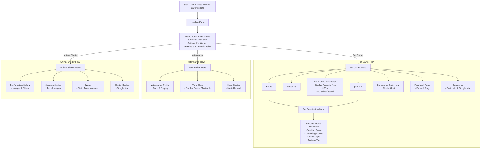
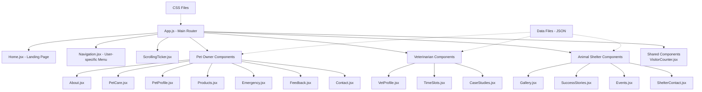

# FurEver Care - They Deserve Forever Love

## Project Flowchart

## Application Structure

## 1. Project Introduction

**Project Name:** FurEver Care - They Deserve Forever Love.
**General Description:** This is a responsive web application (NextGen Website Development) for pet care, providing a platform for pet profile management, appointment scheduling, related products, and community support. The website is designed as a Single Page Application (SPA) with a user-friendly interface, focusing on three main user types: Pet Owners, Veterinarians, and Animal Shelters.
**Platform:** Based on the provided SRS (Software Requirements Specification) document, including context, functional requirements, non-functional requirements, and constraints.
**Main Objective:** To solve the problem of centralized pet care management, provide 24/7 information, promote pet health, support adoption, and build a community.

## 2. Project Scope

**Includes:**

- Home page (Landing Page) with popup form for entering user name (Name) and selecting user type (radio buttons: Pet Owner, Veterinarian, Animal Shelter).
- Dynamic menu based on user type, displaying personalized welcome message and user name in the upper corner.
- Multimedia support: Embedded grooming videos, audio/video health tips, text-based training tips.
- Static data from JSON files (not server-side storage).
- Product filtering, sorting, and searching features (using client-side JS).
- Display of geolocation (HTML5 Geolocation), real-time clock, and scrolling ticker with updates.
- About Us, Contact Us, and Feedback pages (form UI only, no actual submission).

**Excludes (Constraints from SRS):**

- Server-side data storage (only read from JSON, no writing).
- Actual form submission functionality (e.g., Buy Now button non-functional).
- Use of ready-made templates or AI/GPT copied code (except AI-generated images with credit).
- Full backend; focus on responsive frontend.

## 3. User Types and Functional Requirements

### User Types:

**Pet Owner:**

- Form for collecting pet information (name, species, breed, age).
- Sections: Pet Profile (static), Feeding Guide (chart), Grooming Videos, Health Tips (audio/video), Training Tips.
- Pet Product Showcase: Display products from JSON (food, toys, grooming essentials, bedding/apparel, health supplements) with name, image, description, price, Buy Now button. Supports sorting/filtering/searching.
- Emergency and Vet Help: Static contact list (hard-coded table).
- Feedback Page: Name/email/feedback form (UI only).
- Contact Us: Static information, Google Map.

**Veterinarian:**

- Form for collecting information (name, specialization, contact, image).
- Static profile page: Name, specialization, contact, image.
- Time Slots: Display booked/available appointments (static).
- Case Studies: Static pet medical records or case examples.

**Animal Shelter:**

- Gallery: Pet adoption images with name, age, breed, description.
- Filter Button: By type (dog/cat/rabbit) using client-side JS.
- Success Stories: Static text and images.
- Events: Static event announcements (adoption campaigns, vaccination camps).
- Shelter Contact: Google Map.

### Common Features:

- Personalized welcome message.
- Animated menu with hover effects.
- Simulated visitor counter.
- Scrolling ticker with location, time, updates.

## 4. Non-Functional Requirements

- **Safety:** No malicious file uploads; use of static data.
- **Accessibility:** Clear fonts, easy navigation, responsive design.
- **User-Friendly:** Intuitive interface, white background with dark text, easy to view.
- **Performance:** Fast loading, smooth page transitions (SPA).
- **Scalability:** Support for large number of users, 24/7 operation.
- **Compatibility:** Latest browsers (Chrome, Firefox, etc.).
- **Responsive:** Works well on mobile/desktop.

## 5. Technology Stack

- **Frontend:** HTML5, CSS3, Bootstrap (optional), JavaScript, jQuery, ReactJS (for SPA, components).
- **Data Storage:** JSON files (dynamically read via JS).
- **IDE:** Visual Studio Code, Notepad++, etc.
- **Design Tools:** Figma Toolkit for wireframes.
- **Other:** HTML5 Geolocation for location, embedded media for video/audio, Google Maps API for contact.

## 6. Interface Design (UI/UX)

### Sitemap (Based on SRS):

- Landing Page → Popup form to select user type → Corresponding menu.
- Pet Owner: About Us → Pet Care Sections → Pet Product Showcase → Emergency/Vet Help → Feedback → Contact Us.
- Veterinarian: Profile → Time Slots → Case Studies.
- Animal Shelter: Adoption Gallery (with filter) → Success Stories → Events → Contact.

### Visual Design:

- **Colors:** White background, dark text, light accents for buttons and highlights to maintain an easy-to-view interface (instead of pastel tones).
- **Fonts:** Clear, readable (sans-serif like Arial or Open Sans).
- **Elements:** Cards for products, tables for contacts, embedded videos, scrolling ticker at footer.
- **Responsive:** Use of media queries/CSS flex/grid for mobile.

### Wireframes: 

Based on provided images (e.g., Landing page with popup form, sitemap tables, diagrams for pet adoption).

## 7. Implementation Plan and Timeline

- **Phase 1: Planning (1 day - 11/09/2025):** SRS analysis, wireframe design on Figma, creation of JSON data files (fill data needed for products, profiles, contacts, etc.).
- **Phase 2: Development (1.5 days - 12-13/09/2025):**
  - Build frontend SPA with React.
  - Implement functions: Forms, dynamic loading from JSON, filters/sorts.
  - Add features: Geolocation, clock, ticker.
- **Phase 3: Testing (0.5 days - 13/09/2025):** Check responsive, performance, compatibility. Use test data from JSON.
- **Total Time:** 3 days (11/09/2025 - 13/09/2025).

## 8. Resources and Risks

- **Resources:** Frontend developer, images (AI-generated if needed, with credit), test data.
- **Risks:** No use of templates/AI code to avoid evaluation penalties. Focus on creative additional features (e.g., adding animation to menu).
- **Final Product:** Source code, diagrams (flowcharts, data flow), test data, installation guide, project report, video demo.